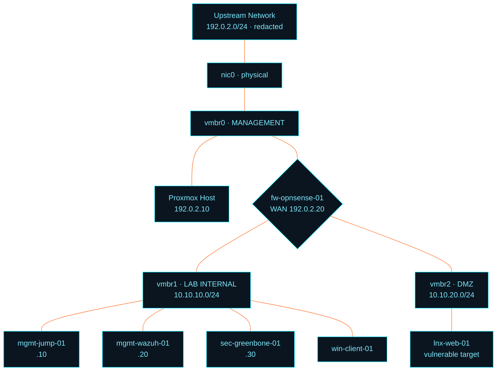

<div align="center">


<p>
  
  
  
  
  
</p>

<p><b>A segmented, self-hosted security operations environment built on commodity hardware —<br>with every failure, root cause, and fix documented along the way.</b></p>

</div>

---

## Overview

This is a working security operations lab: three isolated network segments behind an OPNsense gateway, centralized telemetry in Wazuh, vulnerability management via Greenbone, and Windows and Linux endpoints generating real activity to detect against.

It runs on a 2013 AMD A8 ThinkCentre with 16 GB of RAM. The constraint is deliberate — resource limits force explicit architectural decisions rather than defaults.

Upstream addressing is redacted throughout; see the [addressing note](#architecture).

**What makes this repository different:** it documents the failures. Clock skew silently invalidating package signatures, `reply-to` killing firewall return traffic with no log entry, a Debian image collecting zero logs while reporting no error. Those are the problems that consume real time in real environments, and diagnosing them is the actual skill.

---

## Architecture



`vmbr1` and `vmbr2` are defined with **no physical port**. Lab traffic has no layer 2 path to the upstream network — isolation is structural, not just policy. Explicit block rules on the firewall provide the second layer.

> **Addressing note.** Upstream and management addresses are shown as `192.0.2.0/24` ([RFC 5737](https://datatracker.ietf.org/doc/html/rfc5737) documentation range) rather than the real values. Internal lab subnets are shown as built, since they are non-routable and carry no identifying information. Configuration exports in `config/` are sanitized to match.

---

## Stack

| Capability | Implementation |
|---|---|
| Virtualization | Proxmox VE 9 |
| Segmentation & firewall | OPNsense 26.7, three interfaces, default-deny between segments |
| SIEM / telemetry | Wazuh 4.14 all-in-one |
| Endpoint telemetry | Wazuh agents · Sysmon (Windows) · journald + auditd (Linux) |
| Vulnerability management | Greenbone Community Edition |
| Automation | Python with human approval gates |

---

## Build status

| Phase | Scope | Status |
|---|---|---|
| **1 · Infrastructure** | Hypervisor, segmentation, firewall, isolation verified by test | ✅ Complete |
| **2 · Telemetry** | Wazuh deployed, first agent enrolled, detections firing | 🟠 In progress |
| **3 · Vulnerability management** | Greenbone, scan → triage → remediate → verify | ⬜ Planned |
| **4 · Detection & response** | Custom rules, incident investigation, write-ups | ⬜ Planned |
| **5 · Automation** | Bounded enrichment and triage assistance | ⬜ Planned |

---

## Failure log

Every issue below cost real time and was diagnosed rather than guessed at. Full detail in [`docs/troubleshooting.md`](docs/troubleshooting.md).

<details>
<summary><b>Package signatures rejected as "not live until" a future timestamp</b></summary>

<br>

**Symptom:** `apt update` failed on every repository with signature verification errors referencing future dates.

**Root cause:** The host was installed offline, so `/etc/resolv.conf` carried the installer's fallback nameserver. No DNS meant NTP could never resolve a time server, so the clock drifted. Repository signatures legitimately post-dated the host's notion of "now."

**Fix:** Correct the resolver, then `timedatectl set-ntp true` and restart chrony.

**Takeaway:** Two failures presenting as one. The signature error was three layers downstream of the actual problem — a cascade worth recognizing, because the error message named none of the real causes.

</details>

<details>
<summary><b>Firewall passed traffic but no response ever returned</b></summary>

<br>

**Symptom:** Management UI unreachable. `tcpdump` confirmed SYN packets arriving. `pflog0` recorded no block. Nothing was listening-down; nothing was firewalled. The connection simply timed out.

**Root cause:** OPNsense automatically attaches `reply-to <gateway>` to WAN interface rules, assuming WAN faces a distinct upstream network. Here the admin workstation shared a subnet with the WAN interface, so responses were routed to the gateway rather than directly to the client, and were silently discarded as asymmetric.

**Fix:** Firewall → Settings → Advanced → **Disable reply-to**.

**Takeaway:** A timeout with no corresponding block entry means the problem is on the return path, not the inbound one. Distinguishing "dropped" from "never answered" narrows the search enormously.

</details>

<details>
<summary><b>Locked out by the firewall's own brute-force protection</b></summary>

<br>

**Symptom:** Web UI unreachable from one specific host while firewall rules were demonstrably correct.

**Root cause:** Failed login attempts added the workstation to the `sshlockout` table. That block rule is marked `quick`, so it matched and terminated evaluation before the pass rule was ever considered.

**Diagnosis:** `pfctl -vvsr` shows per-rule counters. The pass rule had 903 evaluations and 0 packets — proof it was being reached but preempted by an earlier `quick` match.

**Fix:** `pfctl -t sshlockout -T flush`

**Takeaway:** A rule with evaluations but zero passed packets is being shadowed. The counters tell you this immediately; reading the rules top-to-bottom does not.

</details>

<details>
<summary><b>Endpoint collected zero logs and reported no error</b></summary>

<br>

**Symptom:** Wazuh agent enrolled and showed `Active`. No events ever arrived.

**Root cause:** Debian 13 minimal images ship journald-only — no rsyslog, so `/var/log/auth.log` does not exist. Wazuh's default file-based collection pointed at a path that was never created, and reported success.

**Fix:** Collect from journald directly:

```xml
<localfile>
  <location>journald</location>
  <log_format>journald</log_format>
</localfile>
```

**Takeaway:** The most dangerous monitoring failure is the silent one. An agent reporting healthy while collecting nothing is worse than an agent that is visibly down, and only verification against known-good test events reveals it.

</details>

<details>
<summary><b>VM boot loop caused by an unquoted shell argument</b></summary>

<br>

**Symptom:** `No bootable device` on a freshly created VM with an ISO attached.

**Root cause:** `--boot order=scsi0;ide2` — bash parsed the semicolon as a command separator. `qm create` received only `order=scsi0`, and the remainder of the line executed as a separate, failing command that scrolled past unnoticed.

**Fix:** `--boot 'order=ide2;scsi0'`

**Takeaway:** Worth internalizing generally: shell metacharacters inside tool arguments need quoting, and a command that partially succeeds is harder to spot than one that fails outright.

</details>

---

## Control verification

Segmentation was tested rather than assumed. **The first run failed.**

| Test | Expected | Initial | After remediation |
|---|---|---|---|
| Lab → internet | Allow | ✅ 200 | ✅ 200 |
| Lab → lab gateway | Allow | ✅ 0% loss | ✅ 0% loss |
| Lab → upstream router | **Block** | ❌ reachable | ✅ 100% loss |
| Lab → hypervisor mgmt | **Block** | ❌ `8006/tcp open` | ✅ `8006/tcp filtered` |

The block rules existed in the design but had never been committed to the firewall — and OPNsense appends new rules *below* the default allow, where they would have had no effect regardless. Layer 2 isolation alone was insufficient, because the gateway routes between all three segments by design.

Evidence in [`evidence/isolation-tests/`](evidence/isolation-tests/).

---

## Detections

| Rule | Description | MITRE | Source |
|---|---|---|---|
| 5710 | SSH login attempt with non-existent user | T1110.001 · T1021.004 | journald |
| 2502 | Repeated authentication failure | T1110 | journald |

Additional detections land as endpoints are onboarded in Phase 2.

---

## Repository structure

```
.
├── docs/
│   ├── phase1-infrastructure.md      # architecture, IP plan, ADRs
│   ├── troubleshooting.md            # full failure log
│   └── adr/                          # architecture decision records
├── evidence/
│   ├── isolation-tests/              # segmentation verification output
│   └── screenshots/
├── config/
│   ├── opnsense/                     # exported rule sets
│   └── wazuh/                        # agent and manager configuration
└── scripts/
```

---

## Safety

This environment hosts intentionally vulnerable systems. It is segmented from all production and personal networks at both layer 2 and layer 3, is never exposed to the public internet, and all offensive activity is confined to hosts within it.

Published configuration is sanitized: upstream addressing, hostnames, credentials, certificates, and agent keys are removed or replaced with documentation-range equivalents. Nothing here reflects a live network.

Nothing in this repository should be deployed on a network you do not own and control.

---

## License

MIT — see [`LICENSE`](LICENSE).

<div align="center">
<br>
<sub><code>Built on a 2013 ThinkCentre. Constraints are a design input.</code></sub>
</div>
