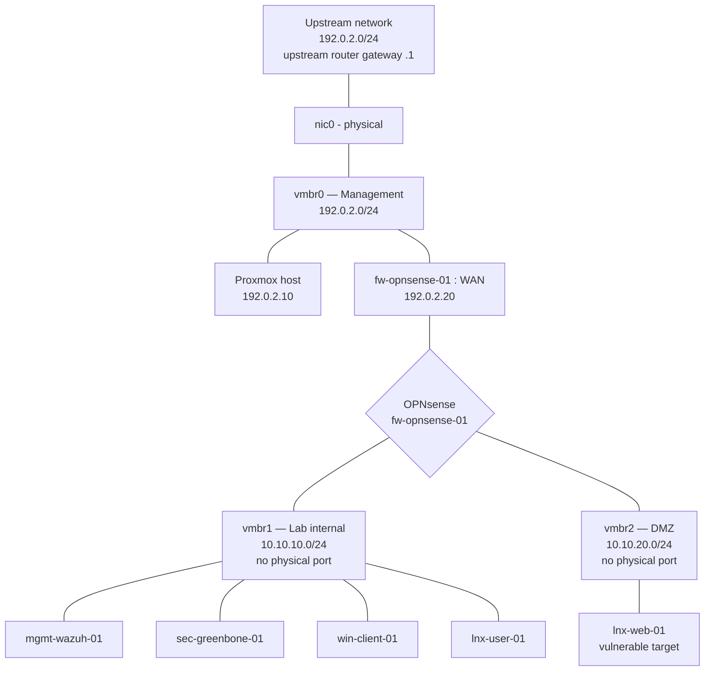

# Phase 1 — Infrastructure Foundation

**Environment:** Self-hosted cyber range / security operations lab
**Platform:** Proxmox VE 9 (Debian 13 "trixie")
**Date completed:** 2026-08-09
**Status:** Complete — segmentation built, firewall operational, ready for Phase 2 telemetry

---

## 1. Host platform

| Attribute | Value |
|---|---|
| Hardware | Lenovo ThinkCentre |
| CPU | AMD A8-6500B APU, 4 cores, no SMT |
| Virtualization | AMD-V (SVM) enabled in BIOS |
| RAM | 16 GB |
| Swap | 8 GB |
| Hypervisor | Proxmox VE 9 |
| Hostname / FQDN | `pve` / `pve.lab.example` |
| Management IP | 192.0.2.10 |

### Storage layout

| Device | Size | Role |
|---|---|---|
| `sdb` | 298 GB | Boot + system. `pve-root` 67.7 GB, `pve-data` thin pool 136.5 GB |
| `sda` | 232 GB | Reclaimed from an abandoned earlier install; rebuilt as VG `labdata`, thin pool `labthin` |

Reclaiming `sda` roughly tripled available VM storage. Lab VM disks are provisioned on `labthin`, keeping guest I/O off the same spindle as the hypervisor root — which also makes snapshots cheaper.

---

## 2. Network segmentation

Single physical NIC. Segmentation is achieved with Linux bridges that have **no physical port attached**, so lab traffic cannot reach the upstream network at layer 2. OPNsense is the sole routed path between segments.

### Bridge definitions

| Bridge | Physical port | Purpose | Subnet | Gateway |
|---|---|---|---|---|
| `vmbr0` | `nic0` | Management — Proxmox UI, admin workstation | 192.0.2.0/24 | 192.0.2.1 (upstream router) |
| `vmbr1` | none | Lab internal — endpoints, SIEM, scanner | 10.10.10.0/24 | 10.10.10.1 (OPNsense LAN) |
| `vmbr2` | none | DMZ — intentionally vulnerable targets | 10.10.20.0/24 | 10.10.20.1 (OPNsense OPT1) |

---

## 3. IP plan

| Host | Segment | Address | Notes |
|---|---|---|---|
| Proxmox host | Management | 192.0.2.10 | DHCP reservation set on upstream router |
| `fw-opnsense-01` WAN | Management | 192.0.2.20 | DHCP from upstream router |
| `fw-opnsense-01` LAN | Lab | 10.10.10.1 | Gateway for lab segment |
| `fw-opnsense-01` OPT1 | DMZ | 10.10.20.1 | Gateway for DMZ segment |
| Lab DHCP pool | Lab | 10.10.10.100–200 | Dynamic clients |
| DMZ DHCP pool | DMZ | 10.10.20.100–200 | Dynamic clients |
| Static lab servers | Lab | 10.10.10.10–50 | Wazuh, Greenbone, jump host |

---

## 4. Naming convention

| Prefix | Meaning | Examples |
|---|---|---|
| `fw-` | Firewall / gateway | `fw-opnsense-01` |
| `mgmt-` | Management / SIEM infrastructure | `mgmt-wazuh-01`, `mgmt-jump-01` |
| `sec-` | Security tooling | `sec-greenbone-01` |
| `win-` | Windows endpoint | `win-client-01`, `win-server-01` |
| `lnx-` | Linux endpoint | `lnx-user-01`, `lnx-web-01` |
| `auto-` | Automation / SOAR | `auto-soc-01` |

---

## 5. VM inventory

| VMID | Name | Segment(s) | vCPU | RAM | Disk | Status |
|---|---|---|---|---|---|---|
| 100 | `fw-opnsense-01` | vmbr0 / vmbr1 / vmbr2 | 2 | 2 GB | 20 GB | Built |
| 101 | `mgmt-jump-01` (LXC) | vmbr1 | 1 | 1 GB | 8 GB | Built — 10.10.10.10 |
| — | `mgmt-wazuh-01` | vmbr1 | 2 | 6 GB | 60 GB | Planned |
| — | `sec-greenbone-01` | vmbr1 | 2 | 6 GB | 40 GB | Planned — run on demand |
| — | `win-client-01` | vmbr1 | 2 | 4 GB | 60 GB | Planned |
| — | `lnx-user-01` | vmbr1 | 1 | 2 GB | 20 GB | Planned |
| — | `lnx-web-01` | vmbr2 | 1 | 2 GB | 20 GB | Planned |

### Resource constraint

Full concurrent allocation exceeds 16 GB. `sec-greenbone-01` is powered on only during scan windows. Vulnerability scanning is episodic, so this does not compromise the discover → triage → remediate → verify workflow. CPU is the tighter constraint: 4 cores with no SMT, and the Wazuh indexer is CPU-hungry under ingest.

---

## 6. Firewall policy

| Interface | Action | Source | Destination | Port | Purpose |
|---|---|---|---|---|---|
| WAN | Pass | 192.0.2.0/24 | WAN address | 443 | Management web UI |
| WAN | Pass | 192.0.2.0/24 | WAN address | 22 | Management SSH |
| LAN | **Block** | LAN net | 192.0.2.0/24 | any | Lab cannot reach upstream network |
| LAN | Pass | LAN net | any | any | Lab internet egress for updates |
| OPT1 | **Block** | OPT1 net | 192.0.2.0/24 | any | DMZ cannot reach upstream network |
| OPT1 | **Block** | OPT1 net | LAN net | any | Prevent DMZ → lab pivot |
| OPT1 | Pass | OPT1 net | any | any | DMZ internet egress |

Block rules must sit **above** the permissive egress rules. OPNsense evaluates top-down, first match wins.

### Safety requirements satisfied

- Lab isolated from production and home devices — enforced at both layer 2 (no physical port on `vmbr1`/`vmbr2`) and layer 3 (explicit block rules)
- Vulnerable targets not publicly exposed — DMZ has no inbound path from any external network
- Management access restricted by source network
- Default-deny between segments; egress permitted only where required for patching

---

## 7. Architecture decision records

### ADR-001 — OPNsense gateway over native Proxmox firewall

**Decision:** Route all lab traffic through an OPNsense VM rather than relying on Proxmox bridge firewall rules.

**Rationale:** Proxmox-native rules are simpler and cheaper in RAM, but produce no demonstrable firewall artifacts. OPNsense yields exportable rule sets, traffic graphs, and a Suricata IDS path in later phases — all portfolio-relevant. Cost is ~2 GB RAM and one core.

**Trade-off accepted:** Higher resource use on a constrained host, and a single point of failure for all lab connectivity.

### ADR-002 — Bridges without physical ports for isolation

**Decision:** `vmbr1` and `vmbr2` are defined with `bridge-ports none`.

**Rationale:** Layer 2 isolation is structural rather than policy-based. A firewall misconfiguration cannot expose lab traffic to the upstream network, because there is no physical path. Defense in depth behind the layer 3 block rules.

**Trade-off accepted:** Lab VMs have no internet access except through OPNsense, which must be running before any guest can reach package repositories.

### ADR-003 — Reclaim second disk as dedicated lab storage

**Decision:** Wipe the abandoned install on `sda` and rebuild it as LVM-thin pool `labthin`.

**Rationale:** 136 GB was insufficient for a Windows Server, a Windows client, and three Linux guests with snapshots. Reclamation added 220 GB at no cost and separates guest I/O from hypervisor root.

### ADR-004 — Disable reply-to on WAN rules

**Decision:** Enable **Firewall → Settings → Advanced → Disable reply-to**.

**Rationale:** OPNsense automatically attaches `reply-to <gateway>` to WAN interface rules, assuming WAN faces a distinct upstream network. In this topology the administrative workstation shares a subnet with the WAN interface, so responses were routed to the upstream router rather than directly to the client and silently dropped as asymmetric. Disabling `reply-to` restores direct return-path routing.

**Trade-off accepted:** Multi-WAN policy routing would require revisiting this setting. Not applicable to a single-uplink lab.

### ADR-005 — Staggered Greenbone operation

**Decision:** `sec-greenbone-01` runs on demand rather than continuously.

**Rationale:** Combined steady-state allocation exceeds physical RAM. Vulnerability scanning is inherently episodic; SIEM ingest is not. Powering the scanner down between cycles preserves continuous telemetry, which is the higher-value capability.

---

## 8. Build log — issues encountered and resolved

Documented deliberately. Diagnostic reasoning is more demonstrative of capability than a clean install would be.

| # | Symptom | Root cause | Resolution |
|---|---|---|---|
| 1 | Host unreachable after install; port 8006 scans found nothing | Scans targeted the wrong subnet — the network is `192.0.2.0/24`, not the assumed `/24` range | Identified correct address via console; corrected assumptions |
| 2 | `apt update` — "Temporary failure resolving" | Offline install left `/etc/resolv.conf` pointing at `192.168.100.1`, the installer's fallback default | Set resolvers to upstream router + Cloudflare; mirrored in Datacenter → DNS |
| 3 | `apt update` — "Not live until <future timestamp>" | Host clock behind real time; no NTP sync because DNS was broken, so repository signatures appeared not yet valid | `timedatectl set-ntp true`, restarted chrony after DNS fix |
| 4 | OPNsense VM boot loop — "No bootable device" | `--boot order=scsi0;ide2` unquoted in bash; `;` parsed as a command separator, so the CD-ROM never entered the boot order | Quoted the argument: `--boot 'order=ide2;scsi0'` |
| 5 | Correct root password rejected | VM still booting the installer ISO rather than the installed system | Set boot order to `scsi0`, detached the ISO |
| 6 | Web UI unreachable; SYNs arrived, no response | Administrative workstation added to the `sshlockout` table after failed login attempts; block rule is `quick` and preempts the pass rule | `pfctl -t sshlockout -T flush` |
| 7 | Still unreachable after flush; pf logged no block | `reply-to` on the auto-generated WAN rule routed responses via the gateway instead of directly to the same-subnet client | Enabled Disable reply-to (see ADR-004) |
| 8 | Lockouts recurred after `pfctl -e` | `pfctl -e` restores the ruleset loaded at disable time, not the saved configuration | Use `configctl filter reload` instead |

### Diagnostic techniques worth reusing

- `tcpdump -ni <iface> port 443` — determines whether packets arrive at all, separating upstream problems from firewall problems
- `tcpdump -ni pflog0` — pf logs each blocked packet with its rule number; eliminates guessing which rule drops traffic
- `pfctl -vvsr` — per-rule evaluation and packet counters; a rule with evaluations but zero packets is being preempted by an earlier `quick` rule
- Timeout vs. connection reset distinguishes a firewall drop from a service that is down

---

## 8a. Control verification

Segmentation was tested from `mgmt-jump-01` (10.10.10.10) on the lab segment rather than assumed correct. **The first run failed.**

### Test 1 — initial state (2026-08-10 03:57 UTC)

| Test | Expected | Actual | Result |
|---|---|---|---|
| Lab → internet (`https://deb.debian.org`) | Success | HTTP 200 | Pass |
| Lab → gateway (`10.10.10.1`) | Success | 0% loss | Pass |
| Lab → upstream router (`192.0.2.1`) | Blocked | **0% loss — reachable** | **FAIL** |
| Lab → Proxmox mgmt (`192.0.2.10:8006`) | Blocked | **open** | **FAIL** |

**Finding:** The lab segment could reach the upstream network and the hypervisor management interface. Segment isolation existed in the design and in the layer 2 topology, but the corresponding layer 3 block rules had never been committed to the firewall. Layer 2 isolation alone was insufficient because OPNsense, by design, routes between all three segments.

**Root cause:** Block rules were planned but not created. OPNsense appends new rules to the bottom of the interface list, below `Default allow LAN to any`; because evaluation is top-down with first match winning, a block rule in that position would also have had no effect.

**Remediation:** Created block rules on LAN and OPT1 and positioned them above the permissive egress rules.

| Interface | Action | Source | Destination |
|---|---|---|---|
| LAN | Block | LAN net | 192.0.2.0/24 |
| OPT1 | Block | OPT1 net | 192.0.2.0/24 |
| OPT1 | Block | OPT1 net | LAN net |

### Test 2 — after remediation (2026-08-10 04:06 UTC)

| Test | Expected | Actual | Result |
|---|---|---|---|
| Lab → internet | Success | HTTP 200 | Pass |
| Lab → gateway | Success | 0% loss | Pass |
| Lab → upstream router | Blocked | 100% packet loss | Pass |
| Lab → Proxmox mgmt | Blocked | `8006/tcp filtered` | Pass |

`filtered` rather than `closed` confirms pf is dropping silently rather than the destination refusing the connection — the correct behaviour for a default-deny posture.

**Conclusion:** Isolation requirements 1 and 5 from the safety requirements are verified by test. Administrative access from the workstation continues to function, as stateful return traffic is unaffected by rules governing lab-originated connections.

---

## 9. Phase 1 deliverables checklist

- [x] Network diagram
- [x] IP plan
- [x] Naming convention
- [x] VM inventory table
- [x] Architecture decision records
- [x] Build log
- [x] Control verification with documented failure and remediation
- [ ] Screenshot — Proxmox node summary
- [ ] Screenshot — bridge configuration
- [ ] Screenshot — OPNsense interface assignments
- [ ] Screenshot — WAN / LAN / OPT1 firewall rule tables
- [ ] Git repository initialized and committed

---

## 10. Next — Phase 2 entry criteria

1. Build `mgmt-jump-01` on `vmbr1` as the lab-side management workstation
2. Verify lab → internet egress and confirm lab → upstream network is blocked
3. Snapshot `fw-opnsense-01` in known-good state before further changes
4. Deploy `mgmt-wazuh-01` and begin endpoint onboarding
